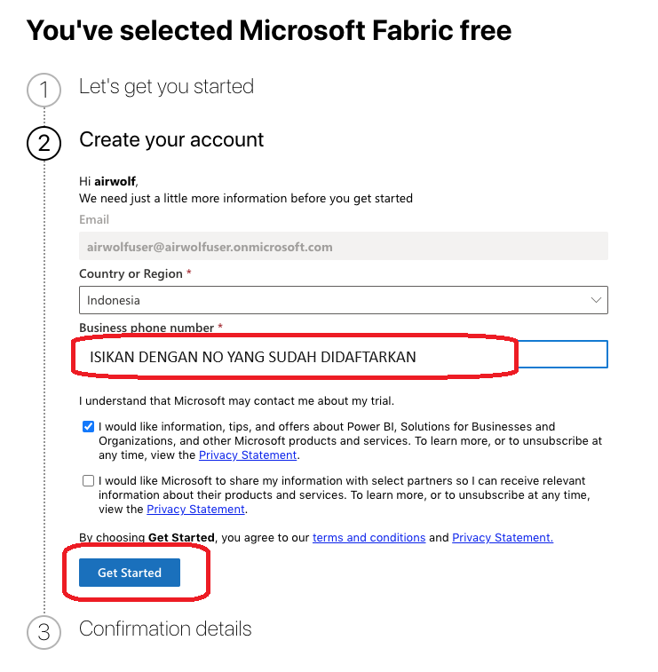

# Membuat Account onmicrosoft.com

## Pendahuluan

Membuat akun dengan domain onmicrosoft.com memiliki beberapa keuntungan yang berkaitan dengan penggunaan layanan Microsoft 365. Salah satu keuntungan tersebut adalah penggunaan Trial Services. Banyak layanan Microsoft 365 menawarkan periode uji coba gratis. Membuat akun onmicrosoft.com memungkinkan Anda untuk memanfaatkan periode uji coba ini untuk mengevaluasi berbagai layanan sebelum berkomitmen pada langganan berbayar.

Salah satu layanan gratis yang bisa dirasakan penggunaannya adalah Power BI Services yang saat ini sudah di-rebranding namanya menjadi Microsoft Fabric. Penggunaan layanan Microsoft Fabric biasanya memerlukan akun organisasi, bisnis atau perusahaan, ataupun institusi pendidikan atau sekolah. Akun organisasi, perusahaan, atau sekolah diperlukan untuk menggunakan Microsoft Fabric karena memberikan keamanan yang lebih baik, memungkinkan manajemen dan administrasi terpusat, mendukung kolaborasi dan integrasi yang efisien, mengatur kebijakan dan kontrol akses, serta menyediakan dukungan teknis dan skalabilitas yang diperlukan dalam lingkungan bisnis atau pendidikan.

Berikut beberapa alasan utamanya:

### 1. Keamanan dan Kepatuhan
Proteksi Data - Akun organisasi atau sekolah dilengkapi dengan fitur keamanan tingkat tinggi yang memastikan data dan informasi pengguna terlindungi dari akses yang tidak sah. Ini termasuk enkripsi, kontrol akses, dan pemantauan ancaman. Kepatuhan Regulasi - Banyak organisasi dan institusi pendidikan harus mematuhi berbagai regulasi dan standar keamanan data (misalnya, GDPR, HIPAA). Akun organisasi membantu memastikan bahwa penggunaan Microsoft Fabric mematuhi regulasi ini.

### 2. Manajemen dan Administrasi Terpusat
Pengelolaan Pengguna - Administrator TI dapat dengan mudah mengelola akun pengguna, mengatur izin, dan memastikan bahwa hanya pengguna yang berwenang yang dapat mengakses data dan aplikasi tertentu. Pemantauan dan Laporan - Akun organisasi memungkinkan pelacakan aktivitas dan pembuatan laporan yang diperlukan untuk audit dan manajemen keamanan.

### 3. Kolaborasi dan Integrasi
Kolaborasi Efisien - Microsoft Fabric dirancang untuk memfasilitasi kolaborasi tim dalam lingkungan kerja atau pendidikan. Akun organisasi memungkinkan berbagai pengguna untuk bekerja sama pada proyek yang sama dengan akses yang dikontrol dan dikelola. Integrasi dengan Layanan Lain - Akun organisasi sering kali terintegrasi dengan layanan Microsoft lainnya seperti Microsoft 365, SharePoint, dan Azure, yang mendukung kolaborasi dan produktivitas yang lebih baik.

### 4. Pengaturan Kebijakan dan Kontrol
Kebijakan TI - Organisasi dapat menerapkan kebijakan TI yang konsisten di seluruh pengguna, seperti kebijakan kata sandi, otentikasi multifaktor, dan aturan penggunaan perangkat. Kontrol Akses - Administrator dapat mengontrol siapa yang memiliki akses ke data tertentu dan apa yang dapat mereka lakukan dengan data tersebut, mengurangi risiko kebocoran data atau penyalahgunaan.

### 5. Skalabilitas dan Dukungan
Dukungan Teknis - Akun organisasi memberikan akses ke dukungan teknis yang lebih lengkap dan spesifik untuk kebutuhan bisnis atau pendidikan. Skalabilitas - Solusi ini dirancang untuk mendukung skalabilitas yang diperlukan oleh organisasi besar dan institusi pendidikan, memungkinkan pertumbuhan pengguna dan data yang dikelola dengan efisien.

## B. Cara Membuat Akun onmicrosoft.com

Untuk membuat akun dengan domain onmicrosoft.com menggunakan akun email gratis dan mengakses skema E5 pada produk Microsoft 365, bisa dilakukan dengan mengikuti langkah-langkah berikut:

### 1. Daftar untuk Uji Coba Gratis Microsoft 365 E5 dengan membuka Situs Microsoft di [office.com](https://www.office.com)
Lalu kunjungi halaman Product Pricing Microsoft 365 untuk Enterprise.

Temukan opsi "E5" dan klik tombol "Try for free".

### 2. Masukkan Informasi Akun email yang akan digunakan. 

Pada contoh ini digunakan email pribadi menggunakan email [Protonmail](https://proton.me/mail). Pastikan pada paket E5 terdapat Power BI (Lingkaran Hijau).

Lanjutkan dengan klik "Set up account" 

Anda akan diminta untuk memasukkan alamat email yang ingin Anda gunakan untuk mendaftar. Masukkan email gratis Anda (misalnya, Gmail, Yahoo), Pekerjaan, No Handphone, Perusahaan. Isikan semua informasi yang wajib atau dibutuhkan karena akan digunakan untuk verifikasi.

Lanjutkan proses dengan mengisi No Handphone untuk proses verifikasi. Klik "Send verification code"

Microsoft akan mengirimkan kode verifikasi ke Handphone Anda. Periksa pesan yang masuk untuk menemukan kode tersebut dan masukkan kode untuk memverifikasi.

### 3. Membuat Domain onmicrosoft.com.

Anda akan diminta untuk memilih nama domain. Nama ini akan digunakan sebagai domain onmicrosoft.com Anda. Misalnya, pada contoh ini digunakan "airwolfuser", domain Anda akan menjadi airwolfuser.onmicrosoft.com.

Masukkan username, domain yang ingin digunakan, serta password. Pastikan nama domain bisa disimpan (save) sehingga muncul tulisan "Edit". Lalu klik "Next"

Sampai disini microsoft akan membuat akun onmicrosoft.com. **TIDAK PERLU MENERUSKAN** proses menyediakan informasi **PAYMENT / PEMBAYARAN**.

### 4. Login ke Microsoft fabric

Pergi ke halaman [app.powerbi.com](https://app.powerbi.com) lalu Submit akun onmicrosoft.com yang sudah dibuat.

Anda akan diminta untuk menyediakan beberapa informasi akun onmicrosoft.com untuk didaftarkan pada Microsoft Fabric, lalu lanjutkan.

### 5. Menyeelesaikan Pendaftaran akun Microsoft Fabric

Selesaikan proses pendaftaran akun onmicrosoft.com sampai proses sign up Microsoft Fabric for free selesai

Setelah selesai, Anda akan memiliki akses ke portal Microsoft Fabric / Power BI Services, lalu klik "Free Trial" pada Profile.

Lalu klik "Start Trial" untuk mengaktifkan Trial gratis Microsoft Fabric / Power BI Services

Layanan Free Trial dapat digunakan selama 60 hari (Tertulis sisa 59 hari). Setelah ini, Report yang dibuat di Power BI Desktop dapat diupload di akun onmicrosoft.com ini. Sampai saat tulisan ini dibuat, Free Trial setelah 60 hari dapat diperpanjang untuk tambahan 60 hari lagi bila masa Free Trial pertama selesai.

Demikian panduan membuat akun onmicrosoft.com. Gunakan dengan bijak. 

